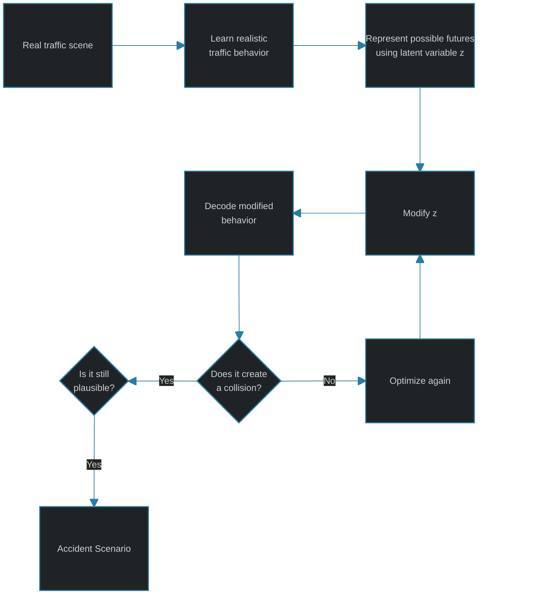

# STRIVE - Stress Test Drive
In this project we are recreating the Nvidia STRIVE model from scratch. This project is for educational purpose only. All copyright goes to [nv lab STRIVE](https://github.com/nv-tlabs/STRIVE).


## Table of content
#### 1. Basic System Requirement
#### 2. STRIVE Blueprint
#### 3. Conceptual order of the project
#### 4. Working order

### Basic System Requirement
| **Component**                 | &nbsp;&nbsp;&nbsp;&nbsp;&nbsp;&nbsp; | **Specification**              |
|-------------------------------|--------------------------------------|--------------------------------|
| Ubuntu                        |                                      | 24.04.4 LTS                    |
| Python                        |                                      | 3.12.3                         |
| PyTorch                       |                                      | 2.12.1                         |
| PyTorch CUDA                  |                                      | 13.0                           |
| torch-geometric               |                                      | 2.8.0.post1                    |
| ConfigArgParse                |                                      | 1.7.5                          |
| NumPy                         |                                      | 1.26.4                         |
| Matplotlib                    |                                      | 3.11.1                         |
| scikit-learn                  |                                      | 1.9.0                          |
| nuScenes devkit               |                                      | 1.2.0                          |
| NVIDIA Driver                 |                                      | 580.95.05                      |
| GPU                           |                                      | NVIDIA GeForce RTX 5090, 32 GB |

### STRIVE Blueprint
- STRIVE is a framework that generates **plausible** accident-prone traffic scenarios.
- A trivial accident generator could simply move another vehicle directly into the ego vehicle.  <br>
<code>Other car ───────────────► Ego car</code> <br>
That creates a collision, but it may produce completely unrealistic traffic behavior.
<br><br>
- STRIVE instead tries to generate something closer to real accident scenario.<br>
Find realistic-looking behaviour that causes a collision




#### Major systems in STRIVE
1. Learned Traffic Model (Understands plausible vehicle motion)
2. Scenario Optimization (Changes latent behaviors to induce collisions)
3. Planner + Evaluation (Tests whether ego can avoid the generated crash)

### Conceptual order of the project
```text
LEVEL 0 — Basic Mathematics
    │
    ├── Coordinates
    ├── Headings
    ├── Rotations
    └── Transformations
    │
    ▼
LEVEL 1
Traffic representation
    │
    ├── vehicle state
    ├── trajectories
    ├── normalization
    └── visibility
    │
    ▼
LEVEL 2
nuScenes dataset
    │
    ├── scenes
    ├── agents
    ├── past/future trajectories
    └── maps
    │
    ▼
LEVEL 3
Scene graph
    │
    ├── agents = nodes
    └── interactions = edges
    │
    ▼
LEVEL 4
Neural-network building blocks
    │
    ├── MLP
    ├── CNN
    ├── GRU
    └── graph message passing
    │
    ▼
LEVEL 5
Traffic CVAE
    │
    ├── past encoder
    ├── future encoder
    ├── map encoder
    ├── prior
    ├── posterior
    ├── latent z
    └── decoder
    │
    ▼
LEVEL 6
Traffic-model losses
    │
    ├── reconstruction
    ├── KL divergence
    ├── vehicle collision
    └── map collision
    │
    ▼
LEVEL 7
Training + inference
    │
    ▼
LEVEL 8
Latent optimization
    │
    ├── initialization optimization
    ├── adversarial optimization
    └── solution optimization
    │
    ▼
LEVEL 9
Planner
    │
    ▼
LEVEL 10
Complete scenario generation
    │
    ▼
LEVEL 11
Evaluation / clustering / visualization
```

### Working order
```text
Geometry / transforms
        ↓
Traffic-state representation
        ↓
nuScenes data processing
        ↓
Map processing
        ↓
Scene graph construction
        ↓
Neural-network building blocks
        ↓
Interaction network
        ↓
Traffic model
        ↓
Traffic-model losses
        ↓
Training / inference
        ↓
Initialization optimization
        ↓
Adversarial optimization
        ↓
Planner integration
        ↓
Solution optimization
        ↓
Complete scenario generation
        ↓
Evaluation / clustering / visualization
```

### At this point, we have
- Project utilities/configuration        ✓
- Coordinate and trajectory transforms  ✓
- Tensor and scene-graph utilities      ✓
- nuScenes trajectory utilities         ✓

### Next Step
- Rasterized local map environment

```mermaid
flowchart TD
    A[nuScenes HD Map]
    A --> B[drivable_area]
    A --> C[carpark_area]
    A --> D[road_divider]
    A --> E[lane_divider]

    B --> F[Rasterized Map]
    C --> F
    D --> F
    E --> F

    F --> G["Agent-Oriented Crop<br/>256 × 256"]
    G --> H[TrafficModel CNN]
